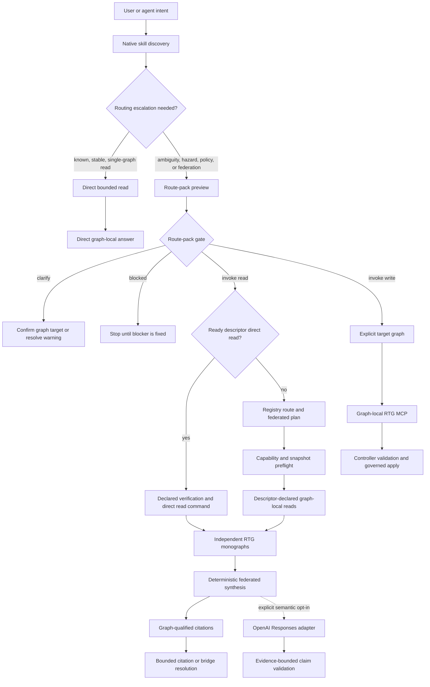

---
twin:
  role: decision
  concerns:
    - component.rtg.graph
    - component.rtg.schema
    - component.rtg.change_validation
    - component.rtg.constraints
    - component.rtg.controller
    - component.rtg.migration
    - component.rtg.query
    - component.rtg.discovery
    - component.rtg.graph_registry
    - component.rtg.route_pack
    - component.rtg.graph_bridge
    - component.rtg.citation_resolution
    - component.rtg.bridge_traversal
    - component.rtg.federated_synthesis
    - component.rtg.evidence_bounded_synthesis
    - repo
---

# Vellis RTG Current System Map

Status: canonical current-system map, updated 2026-07-13.

This document is the recovery point for understanding how the Vellis RTG kernel, graph
monographs, federation control plane, agent skills, evidence, and optional semantic synthesis fit
together. It records current cross-component behavior and authority boundaries, not historical
implementation steps.

Authored SysML remains normative for component and application public contracts. `AGENTS.md` remains
normative for agent operating rules. The monograph registry remains authoritative for the graphs
that exist. When this map conflicts with those sources or executable behavior, fix this map.

## 1. System thesis

Vellis is building a reusable substrate for agent-native software around five commitments:

1. The RTG kernel enforces graph meaning at write boundaries instead of relying on prompt
   discipline.
2. Independently owned graph monographs remain separate authority and identity namespaces.
3. A federation control plane routes intent and coordinates bounded graph-local reads without
   becoming a global graph store.
4. Deterministic records, graph-qualified citations, validation, and replayable evidence remain the
   trusted substrate.
5. Model-generated prose is optional and downstream of deterministic evidence. It cannot silently
   widen graph access or turn citation presence into proof of entailment.

The result is neither one giant graph nor a loose collection of unrelated databases. It is a
federation of governed monographs with an opinionated shared kernel and an explicit routing layer.

## 2. End-to-end system

There are three execution paths:

- **Direct reads** use native skill discovery when one graph and one bounded capability are already
  known and no freshness, evidence, policy, citation, or bridge hazard needs resolution.
- **Federated reads** may route across several graph monographs, but every query executes inside
  one graph and every result retains its graph namespace.
- **Writes** leave the federation control plane after target selection. The target graph's own MCP
  server and controller validate and apply the change. Federation does not proxy graph writes.

Evaluation harnesses may precompute an escalated read route before a measured turn. When the host
supports thread-local skill configuration, the harness can supply a compact resolved route contract
as application context and suppress only the source skill for that fresh thread. That contract must
carry graph scope, verification, freshness, hazards, and execution boundaries without selected-skill
or required-document pointers that would trigger duplicate discovery. This is an experiment surface,
not the default interactive execution path.

## 3. Authority map

| Concern | Authoritative source | Derived or advisory surfaces |
| --- | --- | --- |
| Component contracts and invariants | Authored SysML under `model/bibliotek/` and `model/vellis/` | Generated references, implementations, tests, repo twin projections |
| Agent operating rules | `AGENTS.md` and repo-local skills under `.agents/skills/` | Route-pack selected-skill records |
| Registered graph roots and policies | `docs/rtg-monographs/registry.json` | `vellis_list_graphs`, MCP launch metadata |
| Facts inside one authored monograph | That graph's governed state and ledger | Snapshots, canned read summaries, citations |
| Repository structure and evidence | Repository files and verification runs | Disposable `.data/repo-twin` projection |
| Cross-graph relationships | Confirmed assertions in `docs/rtg-monographs/bridges.json` | Candidate hints and traversal results |
| Routing choice | Current intent plus registry descriptors | Route scores and route packs are advisory |
| Runtime readiness | Current preflight and validation results | Cached or previously reported readiness |
| Federation behavior | Component contracts plus `apps/rtg_federation` | Runbooks and this map |
| Product and strategic rationale | Architecture and research documents | Graph projections that cite those files |

The repository wins when the repo twin disagrees with source files. A graph-local ledger wins over
a stale exported snapshot. An authored SysML contract wins over adapter convenience.

Federated reads may use an in-memory compatibility projection for predecessor snapshots. That
projection is evidence-bearing and reports every removed or converted schema field, but it never
rewrites the source snapshot and does not authorize writes against a schema domain whose current
kernel compatibility is blocked.

## 4. System layers

### 4.1 Opinionated RTG kernel

The graph-local foundation is built from reusable components:

- `component.rtg.schema` owns node and link type definitions, identity criteria, time shapes, and
  schema state.
- `component.rtg.graph` owns live graph records and structural graph invariants.
- `component.rtg.change_validation` and `component.rtg.constraints` decide whether proposed changes
  satisfy schema and policy.
- `component.rtg.controller` sequences validation, apply, snapshots, restore, replay, and ledger
  behavior.
- `component.rtg.migration` governs staged schema evolution and cutover.
- `component.rtg.query` provides deterministic graph-local reads.
- `apps.rtg_knowledge_graph` exposes those contracts through MCP without redefining them.

Kernel modeling rules come from `docs/architecture/agent-first-graph-modeling.md` and their
implemented contract deltas. Important current rules include pure triple links, explicit node time
shapes, schema-declared identity, governed schema changes, non-optional provenance, and queryable
domain structure.

### 4.2 Monographs

A monograph is one independently owned RTG graph root with its own authority, write policy, local
UUID namespace, snapshots, validation state, and MCP launch metadata. A raw UUID, label, or domain
key is never globally meaningful. Cross-graph references use `(graph_id, local_uuid)`.

The registry currently describes:

| Graph | Authority | Write policy | Automatic federated read |
| --- | --- | --- | --- |
| `repo_twin` | Derived from repository | Sync only | Component evidence status |
| `personal_ops` | User authored | Explicit target required | Attention overview |
| `experience_studio` | Team-authored product planning | Explicit target required | Publication readiness |
| `gothic_archive` | Source-grounded archive | Explicit target required | Source index |
| `application_portfolio` | Team-authored product planning | Explicit target required | None declared |
| `time_room_history` | Source-grounded history | Explicit target required | None declared |

This table is a readable projection. `docs/rtg-monographs/registry.json` is authoritative when the
inventory changes.

### 4.3 Federation control plane

`component.rtg.graph_registry` owns graph descriptors, intent compilation, and federated plan
steps. `apps.rtg_federation` composes the registry with preflight, graph-local canned reads,
citations, bridges, and synthesis.

The control plane may:

- list registered graphs and descriptor-declared capabilities
- rank read routes and stop on ambiguity
- require explicit targets for writes
- assemble and gate route packs
- plan bounded reads across several graphs
- execute declared graph-local read capabilities
- synthesize deterministic answer records
- resolve one graph-qualified citation through its declared projection
- traverse one explicit active confirmed bridge while keeping endpoints separate

It may not own monograph data, infer global identity, execute arbitrary cross-graph joins, proxy
graph writes, or treat bridge candidates as traversal permission.

### 4.4 Route packs and agent context

Native harness skill discovery remains responsible for selecting procedural guidance. A known,
stable, read-only operation against one graph may proceed directly when its bounded capability and
narrow verification command are already known and current guidance exposes no freshness, evidence,
policy, citation, or bridge hazard. The direct path still runs that verification; it skips route-pack
preview and gating. Graph-backed routing adds current evidence about where and whether a procedure
can execute when that direct-path assumption does not hold.

A route pack contains:

- selected skill and handoff chain
- scoped federation and graph-local tools
- relevant graph descriptors and route records
- required documents
- verification commands
- freshness and evidence findings
- known hazards

`component.rtg.route_pack` classifies the assembled pack as `invoke`, `clarify`, or `blocked`.
Only `invoke` authorizes the proposed execution path. Route confidence alone never authorizes a
write or bridge traversal.

Route packs are an escalation mechanism, not a universal preflight. Use one for unknown or
ambiguous targets, multi-graph work, policy-sensitive operations, unresolved freshness or evidence,
or cross-graph citation and bridge work. The bounded routing pilot removed broad discovery reads but
still used 2.17 times the tokens and reached the task query 2.68 times later than native execution on
a simple stable read. That result supports keeping the direct path explicit.

When one high-confidence graph declares a ready `metadata.route_pack_read` profile, the adapter may
narrow an invoked pack to that descriptor's verification commands and direct read command. This
`descriptor_read` profile avoids an unnecessary graph-local MCP handoff; it does not widen query
scope or bypass freshness checks. Broader and ambiguous work keeps the federated profile.

### 4.5 Deterministic federation and citations

`component.rtg.federated_synthesis` combines graph-local read records into one read-only envelope.
It preserves each read, limitation, bridge notice, and graph-qualified citation. Unsupported reads
remain visible as limitations rather than disappearing from the answer.

`component.rtg.citation_resolution` resolves one `(graph_id, local_uuid)` through the owning
graph's descriptor-declared bounded projection. Callers cannot supply arbitrary query shapes.

`component.rtg.graph_bridge` stores explicit cross-graph assertions and review candidates.
`component.rtg.bridge_traversal` resolves both endpoints of one active confirmed bridge but does
not merge them, expand another bridge, or construct a joined row.

### 4.6 Optional semantic synthesis

`component.rtg.evidence_bounded_synthesis` accepts the deterministic federation record as its
complete evidence envelope. The first adapter, `apps.rtg_federation.semantic_openai`, uses OpenAI
Responses Structured Outputs only when the federation server is explicitly launched with a
semantic model.

The adapter sends no graph or MCP tools, disables response storage, and cannot run when semantic
mode is not configured. The component rejects:

- claims with no citation
- citations absent from the deterministic source record
- comparisons that cite fewer than two graph namespaces
- inference claims without uncertainty

Accepted results still report `entailment_status=not_verified`. Evidence access is bounded;
semantic truth is not yet proven.

## 5. Operating sequence

For a simple stable read:

1. Use native skill discovery and existing repository guidance.
2. Confirm that the task is read-only, one target graph, bounded capability, and narrow verification
   command are known, and no current hazard requires route evidence.
3. Run the known verification command, then execute the direct bounded read. Escalate if any
   assumption fails.

For an escalated read:

1. Load the federation control-plane skill.
2. Inspect registered graphs and declared capabilities.
3. Run federation preflight.
4. Assemble a route-pack preview for the intent.
5. Gate the route pack. Continue only on `invoke`.
6. If the gate returns `execute_descriptor_read`, run its declared verification commands and
   direct read command.
7. Otherwise compile a single-graph route or multi-graph federated plan.
8. Execute only descriptor-declared graph-local reads.
9. Return deterministic synthesis with graph-qualified citations and explicit limitations.
10. Resolve a citation or traverse one confirmed bridge only when needed.
11. Invoke semantic synthesis only through the separate explicitly configured tool.

For a write:

1. Require an explicit `target_graph_id`.
2. Obtain that graph's MCP launch information.
3. Hand off to the graph-local RTG MCP workflow.
4. Validate graph and system state before proposing changes.
5. Use the governed validation, apply, migration, snapshot, or replay lane owned by that graph.

## 6. Safety invariants

These constraints define the current architecture more strongly than any specific transport:

- Writes always name one target graph explicitly.
- Federation is read-only with respect to graph monographs.
- Graph-local reads execute against one owning graph at a time.
- Native direct reads remain read-only, single-graph, bounded, and free of unresolved route hazards.
- Cross-graph identity is always graph-qualified.
- Missing evidence means unevaluated, not false.
- Candidate bridges do not grant traversal permission.
- Confirmed bridge traversal never becomes identity merge or an arbitrary join.
- Deterministic synthesis precedes optional semantic synthesis.
- Model output is untrusted until evidence-bounded validation accepts it.
- Citation presence never claims semantic entailment.
- The repo twin is disposable and never overrides repository source files.

## 7. Proof surfaces

The system is reconstructed from executable evidence, not this prose alone:

| Question | Command or source |
| --- | --- |
| Is the repo twin current? | `just graph-verify` |
| Which monographs exist? | `just rtg-graphs` |
| Which federated reads are implemented? | `just rtg-federated-capabilities-check` |
| Are snapshots and validation ready? | `just rtg-federation-preflight` |
| Does routing still handle ambiguity and write safety? | `just rtg-federation-eval` |
| Do real multi-graph workloads and citations still work? | `just rtg-federation-workload-eval` |
| Do all repository contracts remain green? | `just check` |
| What does one component own? | Its authored SysML under `model/bibliotek/components/`, or its generated human reference for reading |
| What graph-local operation should run next? | `rtg_get_system_state` through that graph's MCP |

The routing matrix tests planning behavior. The workload matrix executes real snapshots and scores
execution coverage, limitations, citation resolution, bridge traversal, temporal scope, answer
usefulness, claim grounding, and no-join/write safety. Neither substitutes for graph validation or
component contract tests.

## 8. Current maturity boundary

The local federation substrate is operational and regression-tested. It can route, plan, execute
declared reads, preserve citations, traverse governed bridges, and optionally validate model-drafted
claims against deterministic evidence.

It is not yet a production federation service. Current limits include:

- federation components remain draft rather than human-accepted contracts
- no remote graph discovery, tenant authentication, or hosted authorization layer
- no arbitrary query federation or cross-graph join engine
- no global identity resolution
- no semantic entailment evaluator beyond structural claim grounding
- no complete app, adapter, tool, and eval composition projection in the repo twin
- incomplete typed failure and route-history memory

These are product and evidence boundaries, not invitations to weaken the current safety invariants.

## 9. Recovery path

An agent resuming without chat history should use this order:

1. Read this map for the whole-system model.
2. Read `AGENTS.md` for current operating rules and write boundaries.
3. Inspect `docs/rtg-monographs/registry.json` and `docs/rtg-monographs/README.md` for current graph
   inventory and descriptor behavior.
4. Read `.agents/skills/rtg-federation-control-plane/SKILL.md` for the operator sequence.
5. Read the affected authored SysML contracts; use generated references only as human projections.
6. Run the proof commands in section 7 before trusting cached status.
7. Use `docs/guides/vellis/evals/rtg-federation-control-plane-runbook.md` for concrete MCP and CLI examples.

This map should make reconstructing the architecture a reading task, not a design rediscovery task.

## 10. Maintenance rule

Update this document in the same change when any of these change materially:

- the intent-to-execution sequence
- authority or write boundaries
- monograph identity or federation rules
- route-pack contents or gate semantics
- citation or bridge behavior
- deterministic versus model-driven responsibility
- the current maturity boundary

Do not copy component contract details here when a link to the owning spec is enough. Do not turn
this map into a historical log or a speculative roadmap.

Related sources:

- `docs/architecture/agent-first-graph-modeling.md`
- `docs/architecture/kernel-meta-model-program.md`
- `docs/architecture/frontier-authored-graph-runtime.md`
- `docs/rtg-monographs/README.md`
- `docs/guides/vellis/evals/rtg-federation-control-plane-runbook.md`
- `docs/guides/vellis/evals/rtg-federation-routing-cases.json`
- `docs/guides/vellis/evals/rtg-federation-workload-cases.json`
