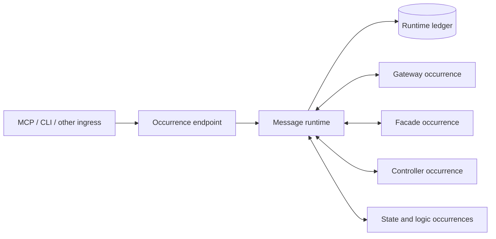

# Bibliotek message-native component runtime

Status: accepted local-first architecture. The normative contracts are the accepted SysML
packages for the messaging kernel, `component.runtime.message_runtime`,
`component.runtime.component_adapter`, and `component.interface.mcp_gateway`. Logical component
contracts remain runtime- and language-neutral.

Review this rule when supervision, retry, federation, or another transport becomes an active
requirement.

## One component primitive

Bibliotek uses one black-box software-component archetype. Components differ through their public
contracts, state, invariants, collaborators, and composed behavior. Store, controller,
coordinator, facade, gateway, actor, and saga describe responsibilities or behavior; they are not
SysML specializations, runtime registration kinds, or implementation base classes.

Any ordinary component action may perform local work, send messages, await responses, compensate,
or combine those behaviors. One occurrence may expose both local and coordinating actions through
the same adapter. The runtime never branches on a component's purpose.

Every runtime-native occurrence has three layers:

1. A logical component contract defining public actions, values, failures, state, invariants, and
   collaborator roles independently of runtime wiring.
2. A participation kit defining action references, codecs, explicit handlers, canonical effects,
   replay functions, and scheduling metadata.
3. An application occurrence binding one concrete implementation and participation kit to a
   persistent runtime address and configured collaborator addresses.

Bibliotek's `ComponentAdapter` is the standard composable participation implementation, not a
required superclass. A non-Bibliotek object may use it or attach any implementation of the same
minimal participant protocol.



## Shared messaging language

`components/runtime/messaging/` owns the stable, serializable vocabulary shared by runtimes and
participation kits:

- runtime addresses and persistent occurrence declarations;
- request, response, fault, and signal envelopes;
- message, trace, correlation, causation, and idempotency identities;
- action references, canonical JSON payload codecs, receipts, and outcomes;
- binding, failure, lane, consistency, delivery, trace, and replay descriptors; and
- the minimal async participant and participant-context protocols.

The kernel contains no controller, saga, store, facade, edge, or gateway category. Envelopes never
carry live objects, callables, connections, credentials, or process-local handles.

### Disclosure boundary

Complete component state is exceptional message data. It crosses an occurrence boundary only for
an explicitly modeled state-transfer operation such as snapshot export/import, restore, checkpoint,
or external document transfer. Ordinary actions carry commands, projections, paginated targeted
reads, canonical deltas, bounded diagnostics, summaries, and opaque references. Query and validation
requests do not contain source snapshots; coordinating participation handlers read the records they
need through public collaborator actions. Faults never echo the request or arbitrary exception
details.

Each state owner applies one prevalidated local batch atomically. Its transient recovery footprint
is limited to touched records and required cascade closure, and is released before the action
returns. A later-owner communication failure after an earlier owner committed is not disguised as
online distributed rollback: the root becomes indeterminate, ordinary ingress quiesces, and the
runtime resolves committed effects through reconstruction.

Binding descriptors classify request, result, fault, and effect payloads as `command`,
`query_result`, `diagnostic`, `canonical_delta`, `state_transfer`, or `external_document`. This is
disclosure and codec metadata, not a component kind. The ledger retains canonical payloads
losslessly in content-addressed storage, while history APIs return envelope and routing metadata
unless a trusted operator explicitly hydrates payloads.

## Participation and action execution

Every occurrence attaches one participant with the same runtime-facing operation:

```python
async def deliver(envelope, context) -> None: ...
```

The standard adapter composes explicit `ActionBinding` registrations, codecs, a bounded
continuation table, replay-state functions, and action metadata. It exposes one uniform handler
shape through `ComponentExecution`. A handler completes its inbound request only through
`complete` or `fault`; it does not return a second runtime result.

Reusable participation metadata is model-owned. `just model-render` projects each Bibliotek
component's action IDs, schemas, codecs, failures, dispositions, lanes, consistency access,
idempotency, deadlines, and replay behavior into its package-local
`resources/runtime_binding.json`. Python participation kits load that resource and supply only
explicit callable/handler mappings, codecs, canonical-effect functions, and replay-state
functions. Reflection may validate a mapped callable, but it does not discover routable methods
or manufacture contract metadata.

The generated Vellis application manifest provides the same authority for façade, runner,
starter-installer, and response-only gateway bindings. Installed-wheel verification loads every
descriptor outside the repository and builds then closes a fresh application, preventing local
source-tree fallback from hiding missing package resources.

Trusted runtime reads are bounded and metadata-first. Counts use database aggregation; terminal
trace summaries paginate without hydrating full causal traces; payload hydration remains an
explicit operator operation. Application outcome lookup accepts only curated MCP root requests.
Internal component messages are not exposed, and state-transfer results remain withheld unless
the original curated transfer is explicitly requested with full inclusion.

Generated handlers for runtime-neutral leaf implementations decode, invoke, and complete. A
coordinating handler uses `send` or `call(step_key, action, arguments, target)`, then completes or
faults the original request. `call` is visibly message-oriented and derives its outbound message
ID deterministically from the inbound request and step key. It is an adapter convenience, not a
runtime `request` operation or a typed business-object proxy.

Application code passes collaborator occurrence keys and action catalogs into coordinating
components. It never injects another business component object. Private calls within one
component implementation are not runtime traffic.

## Runtime identity and topology

- A data root owns one persistent `runtimeId` and readable `runtimeKey`.
- Every occurrence owns an application-scoped `instanceKey` and immutable incarnation
  `instanceId`.
- Addresses always contain `runtimeId` and `instanceId`, including in local v1.
- Restart preserves identities. A future explicit destroy/recreate operation must allocate a new
  incarnation UUID even when it reuses the key.
- Duplicate keys or identities and changed static topology fail startup.
- Static startup durably prepares the complete manifest, registers and attaches every occurrence,
  then confirms the topology atomically.
- Confirmation validates every curated operation's unique ID, target occurrence, target contract,
  action and schema version, and participant attachment before the runtime becomes ready.
- Multiple occurrences of the same contract are valid and remain isolated by exact address.

The application manifest is projected from the Vellis realization model. It records occurrence,
implementation and binding identities, lane declarations, configuration references, replay
authority, curated operations, schema version, and canonical hash. It contains no component-role
or handler-kind discriminator.

The SQLite ledger backend is a bootstrap dependency of the runtime, not an occurrence inside the
runtime whose facts it records.

## Uniform durable delivery

The runtime accepts and routes messages but does not coordinate component behavior. Its central
invariant is: no envelope is delivered before that envelope is durably recorded.

- Requests deliver to the target action lane.
- Responses and faults deliver to the requesting occurrence's always-open response lane.
- Signals deliver to their declared action lane and require acknowledgement.
- A request delivery remains open until exactly one `complete` or `fault`.
- A signal, response, or fault remains open until exactly one `ack`.
- Duplicate, unknown, wrong-kind, or second terminal operations raise
  `RuntimeDeliveryUnknown`.
- A response continuation is owned by the requesting adapter, not a runtime futures map.
- Late responses are recorded, delivered, and acknowledged even after a caller timeout. Completed
  continuations are removed from adapter memory; trusted `lookup_message_outcome(message_id)` reads
  the durable request and terminal outcome without appending traffic.
- A trace becomes terminal only after its root and every causal descendant are terminal.

The runtime hosts participant delivery on its own event-loop thread. Async handlers execute on that
loop; sync leaf methods execute off-loop. A `ComponentEndpoint` lets another loop originate a root
request from an attached occurrence and await its adapter continuation. Caller timeout raises a
failure containing the original message ID and never implies handler cancellation. Resubmitting
the identical message ID observes the current or recorded outcome without re-execution; changing
content under that ID is rejected.

Initial persistence failure prevents dispatch. Terminal persistence failure after an in-memory
effect puts the runtime in fail-stop health and quiesces further work. Restart marks open
deliveries indeterminate and requires reconstruction before ordinary ingress resumes.

Runtime lifecycle uses the modeled `RuntimeHealth` values: `starting`, `ready`, `quiescing`,
`reconstructing`, `recovery_required`, `branch_pending`, `fail_stopped`, `closing`, and `closed`.
Only `ready` accepts ordinary roots. Quiescing accepts descendants of already-open traces so
coordination can settle; recovery-required accepts one authorized recovery root
and its descendants. Reconstruction, branch-pending, fail-stop, and shutdown states reject
ordinary business roots. Persistable transitions are themselves ledger facts.

Caller timeout and action deadline are distinct. The caller may stop waiting without cancelling
the action. The runtime owns delivery deadlines: expiry quiesces new roots and cancels the handler;
off-loop synchronous work must settle before the delivery can become terminal. An ambiguous child
delivery is resolved by deterministic outcome lookup or replay. Confirmed partial multi-owner work
is indeterminate and requires reconstruction rather than a distributed compensation protocol.

## Scheduling and consistency

Each action declares a named bounded FIFO lane, and each occurrence declares each lane's capacity
and worker limit. FIFO applies within a lane; independent lanes may overlap; no cross-lane or global
execution order is promised. A lane worker remains occupied while its handler awaits collaborator
messages, while response delivery remains independently available to resolve the wait.

Actions may also declare a consistency group with `independent`, `shared`, or `exclusive` access.
Admission is writer-preferring: shared actions overlap, an exclusive waiter blocks later shared
admission, and exclusive access lasts through action completion. Response delivery bypasses these
gates. Admission does not reorder a lane. Arbitrary state-dependent admission is not part of v1.

## Operator surface, chronology, and replay

The participant surface contains messaging, delivery, completion, and acknowledgement. The trusted
async operator surface contains health, history, causal traces, reconstruction, and branch
provenance. Components never use the operator surface as an integration shortcut; Vellis exposes
selected projections through `VellisRuntimeServices`.

The append-only runtime ledger is the authority for cross-component chronology. It records runtime
and occurrence lifecycle, accepted/rejected messages, delivery attempts and terminals, canonical
effects, terminal trace disposition, reconstruction, and provenance under monotonic
`runtimePosition` values. Trusted history queries are cursor-paginated and filterable by runtime,
occurrence, contract, action, schema, message identities, status, disposition, position, and time.

Replay never blindly re-delivers recorded commands. State-owning participation kits emit canonical
effects after generated values are resolved and register effect appliers and state-digest
functions. Reads and ordinary coordinating messages contribute no state effect. When a
coordinating action owns the confirmed final outcome, it may emit an aggregate effect that
supersedes derived lower-level effects in that trace. Aggregate effects contain only ordered child
request IDs and immutable effect digests. Reconstruction rejects missing, duplicated, cross-trace,
non-causal, out-of-order, or digest-mismatched references; it never copies a child's state payload
into the coordinator effect.

Reconstruction starts with compatible empty state or a complete set of same-cursor checkpoints,
selects an effect only when both the effect and its trace's committed terminal fact are at or
before the requested cursor, applies selected effects in recorded order, and verifies state
through attached participants. Aborted, indeterminate, and not-yet-committed trace effects are
excluded. A failure after reset or import leaves health recovery-required, never ready with partial
state. Playback does not append new business traffic and never invokes external collaborators;
external dispositions describe post-reconstruction availability and are reported as limitations.
A historical reconstruction enters branch-pending and records verified source provenance before
accepting new traffic.

Component-private ledgers and checkpoints remain black-box state. They may supply replay or digest
functions, but they do not compete with the runtime ledger for cross-component chronology.

## Vellis composition and ingress

Vellis attaches graph, schema, constraint, migration, query, validation, storage, controller,
facade, gateway, runner, and installer occurrences through the same participant mechanism.
Validation assembles invocation-local projections from paginated public reads and delegates
constraint queries to the configured query occurrence, including projected-query evaluation over
the requested delta. It neither imports another component implementation nor sends snapshots.

The RTG controller is an ordinary component whose handlers coordinate collaborators by action
catalog and address. Shared actions preserve coherent reads; exclusive actions protect destructive
coordination. Its unfinished in-memory coordination becomes indeterminate on restart. It owns RTG
sequencing, owner-batch invocation, invariants, and coordinated snapshots, while the runtime owns traffic
chronology, health, and reconstruction.

The facade is an ordinary component retaining Vellis compilation, policy, guidance, and response
shaping. FastMCP passes a tool invocation to the generic gateway mapping. For every invocation the
gateway resolves the registration's target occurrence key and uses its attached occurrence
endpoint to originate that registered action as the root runtime request; translation is not a
redundant gateway-message hop. The same registration set may target several occurrences. The same
endpoint mechanism serves the runner and installer. Composition seals gateway registrations before
topology confirmation; the registration digest is part of the confirmed topology and cannot be
mutated afterward. Production exposes only curated operations.

## Data transfer and v1 limits

Earlier Vellis databases are not upgraded or interpreted. Transfer is state-based: use the source
version to export one coordinated snapshot, initialize a fresh empty current data root, restore
through the facade, validate state and digests, then restart and verify reconstruction. The new
runtime begins a fresh chronology. See
[`docs/guides/vellis/snapshot-transfer.md`](../guides/vellis/snapshot-transfer.md).

V1 deliberately excludes dynamic supervision, occurrence factories, federation, automatic retry,
durable resumption of in-flight actions, pub/sub, arbitrary admission policies, authentication,
distributed consistency, in-place rewind, and runtime-ledger migration. Future features must
compose with the same ordinary component primitive and messaging language rather than introduce
privileged component kinds.
