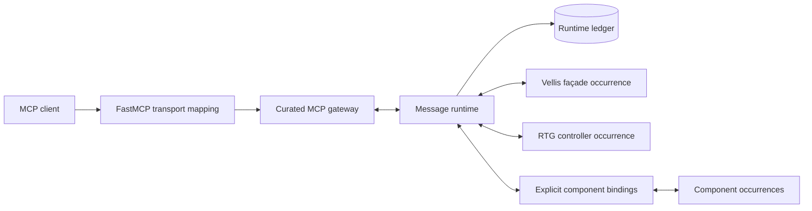

# Bibliotek component runtime architecture

Status: accepted local-first architecture and snapshot-transfer rule. The normative black-box contracts are the accepted
SysML components `component.runtime.message_runtime`, `component.runtime.component_adapter`, and
`component.interface.mcp_gateway`. The accepted logical RTG components remain runtime-neutral.

This document records the cross-component rules that cannot be expressed in one component model.
Review it when dynamic supervision is introduced or distribution becomes an active delivery target.

## Current architecture rule

A first-party Bibliotek application is composed as one runtime, named component occurrences,
explicit runtime bindings, and curated external operations. A component continues to expose its
ordinary runtime-independent protocol. A runtime binding maps only modeled public actions to
versioned messages; it does not turn arbitrary object methods into remote calls.

Vellis is the first runtime-native reference realization. Its MCP gateway, application façade,
controller, and lower component boundaries are runtime-managed. The RTG controller is constructed
only with runtime proxies in the application composition; it retains saga sequencing, compensation,
and coordinated snapshot/restore behavior but owns no traffic ledger, generic replay engine, or SQL
ledger schema. Direct construction with conforming collaborators remains supported for library use.

FastMCP owns MCP-specific function signatures and protocol I/O. The generic gateway loads generated
tool descriptions, parameter schemas, annotations, target occurrence/action IDs, and codec versions,
then validates and dispatches a runtime request. It imports no RTG controller or implementation.
The façade retains Vellis input compilation, validation policy, usage guidance, and response shaping.
The controller retains RTG saga sequencing and cross-component invariants.

## Identity and topology

- A data root has one persistent UUID `runtimeId` and readable `runtimeKey`.
- Every occurrence has an application-scoped `instanceKey` and immutable incarnation UUID
  `instanceId`.
- Runtime addresses always contain `runtimeId` and `instanceId`, including in the local-only v1.
- Local v1 accepts traffic only when both source and target resolve to registered occurrences in
  that runtime. A future federation transport must resolve and authenticate a non-local source
  before local acceptance.
- Ordinary restart preserves both IDs. A future destroy/recreate operation must allocate a new
  `instanceId`, even if it reuses the key.
- The accepted `VellisRuntimePython` occurrence part usages and their realization-local runtime
  binding annotations are the authored static-topology source. Model tooling projects them, in
  declaration order, into the generated application manifest; no Python occurrence table is a
  second authority.
- The generated manifest enumerates static occurrences, implementation/runtime bindings,
  configuration references, replay authority, curated operations, schema version, and a canonical
  manifest hash.
- The topology hash covers runtime identity, occurrence declarations, curated operations, and the
  manifest schema version. A changed topology requires migration; the full manifest hash may
  advance for non-topological generated metadata such as tool prose or parameter schemas after the
  unchanged topology is confirmed.
- Static startup first durably prepares the complete normalized occurrence plan, then registers and
  attaches its occurrences, and finally confirms their action bindings. Once a plan exists, a
  changed or additional occurrence is rejected before insertion; an interrupted first start may
  resume only the same plan.
- Changing the static occurrence inventory requires an explicit topology migration. Startup may
  restore an existing identical registration but may not silently reinterpret one.
- Multiple occurrences of one contract are valid and isolated; routing is always to the exact UUID.

The runtime SQLite database is an internal bootstrap dependency. It is deliberately not registered
as an occurrence in the runtime whose facts it persists, avoiding recursive ledger traffic.

## Messages, routing, and delivery

The immutable envelope identifies its message, kind, exact source/target, component contract,
action, message schema, trace, optional correlation/causation/idempotency identities, creation time,
and canonical versioned payload codec. V1 payloads are canonical JSON-compatible values. Live
objects, callables, handles, credentials, and connections never cross the boundary.

The v1 delivery contract is intentionally small:

- asynchronous `send` and `request` are primary; synchronous Python proxies preserve current
  protocols;
- durable acceptance precedes dispatch;
- each occurrence has a bounded FIFO queue and one worker by default;
- no global execution order is promised;
- there is no automatic retry or cancellation guarantee;
- a caller timeout leaves the accepted handler running and identifies the message to query later;
- a root trace is terminal only after the root and every accepted causal descendant has a recorded
  response or fault;
- new causal children are rejected after the trace is terminal;
- message identity is independent of a future delivery-attempt identity;
- identical reuse of a `messageId` observes the current or recorded outcome without re-execution;
- changed content under an existing ID is rejected;
- terminal encoding or persistence failure after an in-memory effect fail-stops the runtime and
  quiesces already accepted traffic;
- an indeterminate trace closes ordinary ingress until verified reconstruction succeeds;
- while recovery is required, the only message admitted is a sole root action explicitly declared
  as a non-effectful recovery coordinator by its binding.

Component faults are fault messages with their modeled type, message, diagnostic, transaction, and
validation evidence when present. Runtime failures remain a separate family.

## Binding contract

Each first-party binding supplies an explicit descriptor, request/result/failure codecs, server-side
adapter, and client proxy. Every action declares schema and binding versions, idempotency,
concurrency lane, replay disposition, exact concrete failures, whether it is externally effectful,
and whether it is the exceptional recovery ingress. Recovery authorization defaults false and is
valid only for a non-effectful coordinator action. Direct and mediated calls must preserve inputs,
defaults, multiplicities, ordering, public results, concrete failures, and state effects. Generated
identities are included in canonical replay effects.

Bindings do not use reflection to publish methods. Runtime validation rejects an unregistered
action, contract mismatch, codec mismatch, or schema mismatch before component invocation.
Third-party objects may join by implementing the same descriptor/handler SPI; their bindings need
not originate in Bibliotek models.

## Ledger, audit, and trace reads

The append-only runtime ledger records runtime lifecycle, occurrence lifecycle, accepted messages,
delivery attempts, responses/faults, canonical effects, terminal trace disposition, reconstruction,
and branch provenance. `runtimePosition` is a monotonic order of recorded facts, not a distributed
transaction order.

Trusted history reads are cursor-paginated and filter by position/time, runtime, occurrence key or
UUID, component contract, message/trace/correlation/causation identity, action, message kind,
schema version, fact type, delivery status, and trace disposition. A separate trusted operation
returns a complete causal trace. These diagnostics are library/developer operations, not universal
production MCP tools.

The runtime ledger is the authority for cross-component chronology. Component-private ledgers and
checkpoints remain black-box state. Vellis has no second controller ledger and never treats an
earlier Vellis controller ledger as part of the current runtime chronology.

## Replay and reconstruction

Recording messages is not permission to re-deliver every command. State-owning bindings emit a
canonical effect after nondeterministic values are resolved. Reads emit no state effect.
Coordinators contribute trace structure but normally no replay effect. External exchanges are never
repeated during playback.

Only effects in a terminally committed trace are reconstructed. Aborted and indeterminate traces
are excluded. When a coordinator owns the confirmed aggregate outcome of a saga, its binding may
emit one explicitly marked final aggregate effect; the latest such effect replaces lower-level
effects derived earlier in that same trace. Controllers still own saga rollback and compensation;
the runtime does not claim a distributed transaction. Reconstruction starts with empty compatible
occurrences or an explicit checkpoint, applies the selected effects by runtime position while
preserving occurrence/causal order, and reports applied/skipped/incompatible effects and
limitations. Final invariant verification and its nested component reads run as derived playback.
Playback and verification do not append new business traffic.

Replay-state digest/export callbacks are trusted adapter SPI, not canonical business traffic.
Vellis derives the controller aggregate digest through the same graph, schema, constraint, and
migration proxies used by live coordination, while the runtime marks those reads as derived
playback. The helper receives no concrete lower-component host. Digesting and invariant
verification therefore preserve the component boundary and append neither accepted-message facts
nor canonical effects; the snapshot-transfer restart test proves that property.

The ordinary SQL binding is an explicit durable external boundary: the runtime records its
requests and outcomes but never re-executes arbitrary SQL during reconstruction. Each SQL
occurrence retains state in its own database file; backup, checkpoint, and historical database
reconstruction remain outside the accepted generic SQL contract until a dedicated binding earns
those semantics.

Vellis snapshot restore is an ordinary message-mediated saga. The controller validates the
candidate through the validation occurrence, invokes each state owner's full-snapshot replacement
action, and compensates through those same actions on a modeled failure. The trace retains those
component messages and effects for audit, while the successful controller restore emits the final
coordinated effect that supersedes its derived lower-level effects for reconstruction.

Historical exploration is isolated in v1: copy the data root, attach compatible empty occurrences,
and reconstruct through a selected cursor. Any explicit cursor behind the source runtime head
durably enters `branch_pending`, which survives restart and rejects ordinary traffic. The trusted
branch operation rechecks every represented occurrence digest and records the exact source runtime,
cursor, and combined verified digest before opening new traffic. The runtime reconstructs managed
component state, never the external world; recorded inbound results may be played back, but old
outbound effects are not repeated.
External boundary IDs are occurrence keys. Reconstruction defaults encountered boundaries to
`playback_only`; an operator may instead report them as `live`, `simulated`, or `unavailable` for
continuation after the selected cursor. Historical evaluation still uses recorded responses and
never invokes the old outbound effect.

## Vellis data transfer rule

The runtime cutover is complete for new Vellis data roots. Earlier data roots are never upgraded by
importing, merging, or projecting their controller ledger. Transfer is deliberately state-based:

1. Open the source with the Vellis version that created it, validate the graph, and export one full
   coordinated snapshot.
2. Initialize a separate empty current Vellis data root.
3. Load and restore the snapshot through the current application façade.
4. Treat the complete restore trace and its final coordinated canonical effect as the destination
   runtime's first authoritative state-changing chronology.
5. Validate domain counts/digests and one destination restart before retiring the source.

The operational procedure lives in `docs/guides/vellis/snapshot-transfer.md`. The legacy-named
replay, verification, migration-history, and ledger-flush MCP operations remain temporarily as
curated façade projections over runtime reconstruction, trace history, and fail-stop health; none
delegate to or import an earlier controller ledger.

## Deliberate v1 exclusions and future seams

V1 has no network broker, pub/sub, automatic retries, authentication layer, dynamic factories,
federation, or in-place rewind. A later `component.runtime.component_supervisor` may add allowlisted
factory profiles and create/ready/drain/stop/destroy/recreate lifecycle operations. A managed
multi-RTG subsystem is the intended first dynamic consumer.

Distribution remains deferred, but addresses retain runtime identity, APIs are asynchronous,
payloads and bindings are versioned/serializable, routing and ledger persistence sit behind narrow
boundaries, and components may not assume shared memory, threads, files, or process identity.

## Verification gate

Runtime work must keep the following evidence green: append-before-dispatch, fail-stop,
deduplication, FIFO/concurrency, nested causal identity, timeout behavior, address/schema rejection,
history determinism, restart identity, same-type isolation, direct/message binding equivalence,
generated-ID replay, private-method rejection, exact reconstruction, external-effect suppression,
manifest completeness, MCP inventory/codec/protocol compatibility, and snapshot-transfer/restart
fixtures.

For each accepted slice run model rendering/diff/formal checks, narrow boundary tests, lint,
type checking, the full test suite, and the aggregate repository check.
