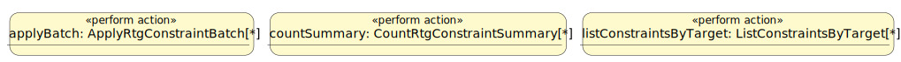

# component.rtg.constraints

Generated from textual SysML v2 by `just model-render` as a non-normative reading projection; do not edit by hand.

- Model definition: `RtgConstraints`
- Lifecycle: `accepted`
- Purpose: Own declarative constraint records and derived kind/target/live indexes, while evaluation remains with validation/query consumers.

## Provided actions

| Feature | Contract | Signature | Principal failures | Meaning |
|---|---|---|---|---|
| `exportSnapshot` | `ExportConstraintSnapshot` | out `snapshot: RtgConstraintSnapshot` | None | Export every full constraint record without evaluating it or inspecting other components. |
| `replaceSnapshot` | `ReplaceConstraintSnapshot` | in `snapshot: RtgConstraintSnapshot` | `RtgConstraintSnapshotInvalid`, `RtgConstraintUuidInvalid`, `RtgConstraintUuidConflict`, `RtgConstraintKindInvalid`, `RtgConstraintDefinitionInvalid`, `RtgConstraintPayloadInvalid`, `RtgConstraintSystemValueInvalid` | Validate the complete candidate, then atomically replace every constraint record and rebuild derived indexes. |
| `putConstraint` | `PutConstraint` | in `constraint: RtgConstraintDefinition`; out `stored: RtgConstraintDefinition` | `RtgConstraintUuidInvalid`, `RtgConstraintUuidConflict`, `RtgConstraintKindInvalid`, `RtgConstraintDefinitionInvalid`, `RtgConstraintPayloadInvalid`, `RtgConstraintSystemValueInvalid` | Generate or preserve identity, validate kind-specific structure and bounds, and atomically create or fully replace one record. A kind/payload type mismatch is RtgConstraintDefinitionInvalid; malformed contents of the selected payload are RtgConstraintPayloadInvalid. |
| `getConstraint` | `GetConstraint` | in `constraintUuid: Uuid`; out `constraint: RtgConstraintDefinition` | `RtgConstraintNotFound` | Return one full constraint definition by UUID without executing it. |
| `applyBatch` | `ApplyRtgConstraintBatch` | in `changes: RtgConstraintChangeSet`; out `result: RtgConstraintBatchResult` | `RtgConstraintUuidInvalid`, `RtgConstraintUuidConflict`, `RtgConstraintKindInvalid`, `RtgConstraintDefinitionInvalid`, `RtgConstraintPayloadInvalid`, `RtgConstraintSystemValueInvalid`, `RtgConstraintNotFound` | Apply one resolved constraint-local change set atomically. |
| `countSummary` | `CountRtgConstraintSummary` | out `result: RtgConstraintCountSummary` | None | Return bounded live and non-live constraint counts without returning definitions. |
| `listConstraints` | `ListConstraints` | in `kind: RtgConstraintKind[0..1]`; in `live: Boolean[0..1]`; in `offset: Integer` = `0`; in `limit: Integer[0..1]`; out `result: RtgConstraintDefinitionList` | `RtgConstraintKindInvalid`, `RtgConstraintPayloadInvalid` | List one stable page of definitions with optional kind/live filters. |
| `listConstraintsByTarget` | `ListConstraintsByTarget` | in `targetTypeKey: String`; in `kind: RtgConstraintKind[0..1]`; in `live: Boolean[0..1]`; out `result: RtgConstraintDefinitionList` | `RtgConstraintTargetInvalid`, `RtgConstraintKindInvalid` | List definitions whose target metadata contains one type key, optionally filtered by constraint kind and live status. |
| `deleteConstraint` | `DeleteConstraint` | in `constraintUuid: Uuid`; out `result: RtgConstraintDeleteResult` | `RtgConstraintNotFound` | Delete exactly one definition without cascading into graph, schema, migration, or validation state. |

## Construction actions

| Contract | Signature | Principal failures | Meaning |
|---|---|---|---|
| `CreateEmptyRtgConstraints` | out `constraints: RtgConstraints` | None | Return an empty registry with empty derived indexes. |
| `ImportRtgConstraintSnapshot` | in `snapshot: RtgConstraintSnapshot`; out `constraints: RtgConstraints` | `RtgConstraintSnapshotInvalid`, `RtgConstraintUuidInvalid`, `RtgConstraintUuidConflict`, `RtgConstraintKindInvalid`, `RtgConstraintDefinitionInvalid`, `RtgConstraintPayloadInvalid`, `RtgConstraintSystemValueInvalid` | Validate all identities, records, payloads, bounds, and system values before rebuilding indexes and exposing the registry. |

## Retained collaborator roles

| Role | Kind | Referenced type | Multiplicity |
|---|---|---|---|
| — | — | — | No retained collaborator roles. |

## Owned state

| State feature | Type | Ownership | Meaning |
|---|---|---|---|
| `constraintRecords` | `RtgConstraintDefinition` | `owned` | Canonical component-owned constraint-definition occurrences. |
| `derivedIndexes` | `JsonObject` | `derived` | Ephemeral indexes derived from canonical constraint definitions. |

## Action and state effects

| Action | State / collaborator | Access | Modeled effect |
|---|---|---|---|
| `exportSnapshot` | `constraintRecords` | `read` | read all canonical records. |
| `replaceSnapshot` | `constraintRecords` | `write` | validate before visibility, atomically replace every record, and rebuild indexes. |
| `applyBatch` | `constraintRecords` | `write` | expose the complete resolved constraint change set or leave canonical constraint state unchanged. |
| `countSummary` | `derivedIndexes` | `read` | return only bounded aggregate counts. |
| `putConstraint` | `constraintRecords` | `write` | atomically create/replace one record and rebuild affected indexes. |
| `getConstraint` | `constraintRecords` | `read` | read one canonical record. |
| `listConstraints` | `derivedIndexes` | `read` | read kind/live indexes. |
| `listConstraintsByTarget` | `derivedIndexes` | `read` | read target/kind/live indexes. |
| `deleteConstraint` | `constraintRecords` | `delete` | remove one record and affected indexes. |

## Native action behavior

| Public action | Nested semantic actions | Observable successions |
|---|---|---|
| — | — | No action decomposition required at this boundary. |

## Invariants and behavioral obligations

| Stable ID | Subject | Satisfier | Required constraint |
|---|---|---|---|
| `contract.rtg.constraints.write_effect` | `PutConstraint` | `registry.putConstraint` | Missing UUID generates identity; supplied identity is preserved. Kind selects a compatible typed payload, target keys are unique and unordered, descriptions remain human-readable, missing live becomes true, and writes do not execute rules. Duplicate target keys are rejected rather than silently repaired. |
| `contract.rtg.constraints.read_effect` | `RtgConstraints` | `registry` | Reads honor explicit filters, use ascending textual constraint UUID order, derive only from canonical records/indexes, and never inspect or mutate graph/schema state. |
| `contract.rtg.constraints.delete_effect` | `DeleteConstraint` | `registry.deleteConstraint` | Delete removes exactly one definition and index entries with no cross-component cascade. |
| `contract.rtg.constraints.snapshot_effect` | `RtgConstraints` | `registry` | Snapshot round-trip preserves full records and normalized live state; import and in-place replacement validate the whole candidate before visibility. Rejected replacement preserves prior state, and replacing with the current snapshot is idempotent. |
| `contract.rtg.constraints.snapshot_replacement` | `ReplaceConstraintSnapshot` | `registry.replaceSnapshot` | Whole-candidate validation precedes visibility; success atomically replaces all records and indexes, failure preserves the prior registry, and replacing with an identical snapshot is idempotent. |
| `contract.rtg.constraints.intentional_boundary` | `RtgConstraints` | `registry` | This registry owns declarative definitions only. It does not execute constraints, inspect or mutate graph/schema/migration state, choose migration membership, own durable persistence or workflow, provide general graph query/inference, or attach v1 severity/blocking policy. UUID alone identifies a definition; names and target keys may be shared by multiple definitions. |
| `invariant.rtg.constraints.uuid_unique` | `RtgConstraints` | `registry` | Constraint UUIDs are unique. |
| `invariant.rtg.constraints.display_name_not_identity` | `RtgConstraints` | `registry` | Display name is non-unique navigation text, not identity. |
| `invariant.rtg.constraints.live_status_boolean` | `RtgConstraints` | `registry` | Missing live normalizes to true and supplied live is Boolean. |
| `invariant.rtg.constraints.no_validation_execution` | `RtgConstraints` | `registry` | The store never executes constraints or validates graph objects. |
| `invariant.rtg.constraints.cardinality_rules_live_here` | `RtgConstraints` | `registry` | Query-binding cardinality rule definitions are owned here rather than in schema definitions. Global rules count distinct binding UUIDs across the result; grouped rules apply bounds independently to each unique group-binding UUID tuple, including zero-count groups exposed by optional link requirements. |
| `invariant.rtg.constraints.no_severity_policy_v1` | `RtgConstraints` | `registry` | V1 definitions contain no violation severity or blocking policy. |
| `invariant.rtg.constraints.pattern_compatibility` | `RtgConstraints` | `registry` | Query-pattern and cardinality payloads use the canonical RtgQuerySpec and name valid bindings structurally; evaluation belongs to validation/query. |
| `invariant.rtg.constraints.indexes_match_records` | `RtgConstraints` | `registry` | Derived kind, target, and live indexes exactly match canonical records. |
| `contract.rtg.constraints.export_constraint_snapshot.failures` | `ExportConstraintSnapshot` | `registry.exportSnapshot` | Export is state-neutral and has no declared domain failure. |
| `contract.rtg.constraints.replace_constraint_snapshot.failures` | `ReplaceConstraintSnapshot` | `registry.replaceSnapshot` | Rejected replacement leaves canonical records and indexes unchanged. |
| `contract.rtg.constraints.put_constraint.failures` | `PutConstraint` | `registry.putConstraint` | Rejected writes leave canonical records and indexes unchanged. |
| `contract.rtg.constraints.get_constraint.failures` | `GetConstraint` | `registry.getConstraint` | Read failure has no effect. |
| `contract.rtg.constraints.list_constraints.failures` | `ListConstraints` | `registry.listConstraints` | Read failure has no effect. |
| `contract.rtg.constraints.list_constraints_by_target.failures` | `ListConstraintsByTarget` | `registry.listConstraintsByTarget` | Read failure has no effect and never inspects schema or graph state. |
| `contract.rtg.constraints.delete_constraint.failures` | `DeleteConstraint` | `registry.deleteConstraint` | Rejected delete has no effect. |
| `contract.rtg.constraints.create_empty_rtg_constraints.failures` | `CreateEmptyRtgConstraints` | `createEmptyRtgConstraintsSubject` | Construction has no declared domain failure. |
| `contract.rtg.constraints.import_rtg_constraint_snapshot.failures` | `ImportRtgConstraintSnapshot` | `importRtgConstraintSnapshotSubject` | Failure returns no partially imported registry. |
| `contract.rtg.constraints.batch_atomicity` | `ApplyRtgConstraintBatch` | `registry.applyBatch` | Success exposes the complete requested constraint-local batch; rejection or failure exposes the exact prior constraint state. |
| `invariant.rtg.constraints.routine_work_is_delta_scaled` | `RtgConstraints` | `registry` | A non-state-transfer action does not copy, serialize, hash, or retain complete constraint state solely for validation, atomicity, or recovery. Transient work may grow with the requested mutation and affected index closure, but not unrelated constraints. Explicit state-transfer and reconstruction actions are exceptions. |
| `contract.rtg.constraints.apply_batch.failures` | `ApplyRtgConstraintBatch` | `registry.applyBatch` | Any invalid reference, definition, payload, uniqueness conflict, or deletion rejects the whole batch without observable constraint state effect. |
| `contract.rtg.constraints.count_summary.failures` | `CountRtgConstraintSummary` | `registry.countSummary` | Summary reads expose bounded counts and do not change constraint state. |

## Public values and items

| Public definition | Kind | Fields | Meaning |
|---|---|---|---|
| `RtgConstraintPayload` | `attribute` | — | One query-pattern or cardinality payload selected by constraint kind. |
| `RtgConstraintQueryPatternPayload` | `attribute` | `querySpec: RtgQuerySpec`, `expectation: RtgConstraintExpectation` | Defined by its typed fields and action requirements. |
| `RtgConstraintCardinalityPayload` | `attribute` | `querySpec: RtgQuerySpec`, `countedBinding: String`, `minimum[0..1]: Integer`, `maximum[0..1]: Integer`, `groupByBindings[0..*]: String` | Bounds are non-negative and at least one is present. groupByBindings contains unique non-empty names from the query's global binding namespace. Empty groupByBindings preserves global cardinality; otherwise each unique group-binding UUID tuple counts distinct counted-binding UUIDs independently. |
| `RtgConstraintDefinition` | `item` | `uuid[0..1]: Uuid`, `kind: RtgConstraintKind`, `targetTypeKeys[0..*]: String`, `displayName: String`, `description: String`, `payload: RtgConstraintPayload`, `system: JsonObject` | UUID may be absent on write only. Stored definitions have concrete UUID and Boolean system.live, defaulting missing live to true. targetTypeKeys has native unique, unordered set semantics; duplicate inputs are invalid and realization encodings may use a canonical order. |
| `RtgConstraintSnapshot` | `attribute` | `constraints[0..*]: RtgConstraintDefinition` | Defined by its typed fields and action requirements. |
| `RtgConstraintDefinitionWrite` | `attribute` | `ref: RtgChangeReference`, `constraint: RtgConstraintDefinition` | Defined by its typed fields and action requirements. |
| `RtgConstraintLiveStatusChange` | `attribute` | `targetRef: RtgChangeReference`, `live: Boolean` | Defined by its typed fields and action requirements. |
| `RtgConstraintChangeSet` | `attribute` | `constraintWrites[0..*]: RtgConstraintDefinitionWrite`, `deleteConstraints[0..*]: RtgChangeReference`, `setLive[0..*]: RtgConstraintLiveStatusChange` | Defined by its typed fields and action requirements. |
| `RtgConstraintBatchResult` | `attribute` | `writes: Integer`, `deletes: Integer`, `liveChanges: Integer` | Defined by its typed fields and action requirements. |
| `RtgConstraintCountSummary` | `attribute` | `liveTotal: Integer`, `nonLiveTotal: Integer` | Defined by its typed fields and action requirements. |
| `RtgConstraintDefinitionList` | `attribute` | `constraints[0..*]: RtgConstraintDefinition` | Defined by its typed fields and action requirements. |
| `RtgConstraintDeleteResult` | `attribute` | `deletedConstraint: RtgConstraintDefinition` | Defined by its typed fields and action requirements. |
| `RtgConstraintNotFound` | `attribute` | `message: String` | Defined by its typed fields and action requirements. |
| `RtgConstraintSnapshotInvalid` | `attribute` | `message: String` | Defined by its typed fields and action requirements. |
| `RtgConstraintUuidInvalid` | `attribute` | `message: String` | Defined by its typed fields and action requirements. |
| `RtgConstraintUuidConflict` | `attribute` | `message: String` | Defined by its typed fields and action requirements. |
| `RtgConstraintKindInvalid` | `attribute` | `message: String` | Defined by its typed fields and action requirements. |
| `RtgConstraintDefinitionInvalid` | `attribute` | `message: String` | Defined by its typed fields and action requirements. |
| `RtgConstraintPayloadInvalid` | `attribute` | `message: String` | Defined by its typed fields and action requirements. |
| `RtgConstraintSystemValueInvalid` | `attribute` | `message: String` | Defined by its typed fields and action requirements. |
| `RtgConstraintTargetInvalid` | `attribute` | `message: String` | Defined by its typed fields and action requirements. |

## Public enumerations

| Enumeration | Logical literals |
|---|---|
| `RtgConstraintKind` | `query_pattern`, `cardinality` |
| `RtgConstraintExpectation` | `must_match_at_least_one`, `must_match_none` |

## Verification

| Verification | Subject | Objectives | Evidence |
|---|---|---|---|
| `PutConstraintContractVerification` | `PutConstraint` | `constraintWriteEffect`, `putConstraintFailureSemantics` | `components/rtg/constraints/tests/test_rtg_constraints_contract.py#PutConstraintContractVerification` |
| `DeleteConstraintContractVerification` | `DeleteConstraint` | `constraintDeleteEffect`, `deleteConstraintFailureSemantics` | `components/rtg/constraints/tests/test_rtg_constraints_contract.py#DeleteConstraintContractVerification` |
| `ExportConstraintSnapshotContractVerification` | `ExportConstraintSnapshot` | `exportConstraintSnapshotFailureSemantics` | `components/rtg/constraints/tests/test_rtg_constraints_contract.py#ExportConstraintSnapshotContractVerification` |
| `ReplaceConstraintSnapshotContractVerification` | `ReplaceConstraintSnapshot` | `snapshotReplacementEffect`, `replaceConstraintSnapshotFailureSemantics` | `components/rtg/constraints/tests/test_rtg_constraints_contract.py#ReplaceConstraintSnapshotContractVerification` |
| `GetConstraintContractVerification` | `GetConstraint` | `getConstraintFailureSemantics` | `components/rtg/constraints/tests/test_rtg_constraints_contract.py#GetConstraintContractVerification` |
| `ListConstraintsContractVerification` | `ListConstraints` | `listConstraintsFailureSemantics` | `components/rtg/constraints/tests/test_rtg_constraints_contract.py#ListConstraintsContractVerification` |
| `ListConstraintsByTargetContractVerification` | `ListConstraintsByTarget` | `listConstraintsByTargetFailureSemantics` | `components/rtg/constraints/tests/test_rtg_constraints_contract.py#ListConstraintsByTargetContractVerification` |
| `CreateEmptyRtgConstraintsContractVerification` | `CreateEmptyRtgConstraints` | `createEmptyRtgConstraintsFailureSemantics` | `components/rtg/constraints/tests/test_rtg_constraints_contract.py#CreateEmptyRtgConstraintsContractVerification` |
| `ImportRtgConstraintSnapshotContractVerification` | `ImportRtgConstraintSnapshot` | `importRtgConstraintSnapshotFailureSemantics` | `components/rtg/constraints/tests/test_rtg_constraints_contract.py#ImportRtgConstraintSnapshotContractVerification` |
| `ConstraintBatchAtomicityContractVerification` | `ApplyRtgConstraintBatch` | `constraintBatchAtomicity`, `applyRtgConstraintBatchFailureSemantics` | `components/rtg/constraints/tests/test_rtg_constraints_contract.py#ConstraintBatchAtomicityContractVerification` |
| `ConstraintRoutineWorkScalingVerification` | `RtgConstraints` | `constraintRoutineWorkBounded` | `components/rtg/constraints/tests/test_rtg_constraints_contract.py#ConstraintRoutineWorkScalingVerification` |
| `CountConstraintSummaryContractVerification` | `CountRtgConstraintSummary` | `countConstraintSummaryFailureSemantics` | `components/rtg/constraints/tests/test_rtg_constraints_contract.py#CountConstraintSummaryContractVerification` |
| `RtgConstraintsBoundaryVerification` | `RtgConstraints` | `constraintReadEffect`, `snapshotEffect`, `intentionalBoundary`, `uuidUnique`, `displayNameNotIdentity`, `liveStatusBoolean`, `noValidationExecution`, `cardinalityRulesLiveHere`, `noSeverityPolicyV1`, `patternCompatibility`, `indexesMatchRecords` | `components/rtg/constraints/tests/test_rtg_constraints_contract.py#RtgConstraintsBoundaryVerification` |

## Diagram

[PlantUML source](../diagrams/component.rtg.constraints.contract.puml)

Equivalent private algorithms, helpers, storage layouts, and implementation-language inheritance remain implementation choices.
