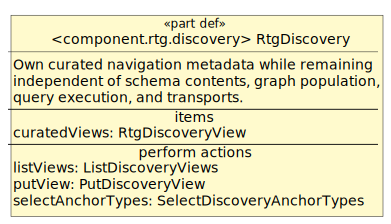

# component.rtg.discovery

Generated from textual SysML v2 by `just model-render` as a non-normative reading projection; do not edit by hand.

- Model definition: `RtgDiscovery`
- Lifecycle: `draft`
- Purpose: Own curated navigation metadata while remaining independent of schema contents, graph population, query execution, and transports.

## Provided actions

| Feature | Contract | Signature | Principal failures | Meaning |
|---|---|---|---|---|
| `putView` | `PutDiscoveryView` | in `view: RtgDiscoveryView`; out `stored: RtgDiscoveryView` | `RtgDiscoveryViewInvalid` | Validate and create or completely replace the view with the same viewId. Anchor type keys remain opaque and are not checked against schema. |
| `listViews` | `ListDiscoveryViews` | out `result: RtgDiscoveryViewList` | None | Return full curated views in ascending viewId order without mutation. |
| `selectAnchorTypes` | `SelectDiscoveryAnchorTypes` | in `viewId: String`; in `coordinates: RtgDiscoveryCoordinates[1..*]`; out `result: RtgDiscoverySelection` | `RtgDiscoveryViewNotFound`, `RtgDiscoverySelectionInvalid` | Preserve requested coordinates and return the first-occurrence, de-duplicated anchor type keys plus coordinate-to-description mapping for the selected cells. |

## Construction actions

| Contract | Signature | Principal failures | Meaning |
|---|---|---|---|
| `CreateEmptyRtgDiscovery` | out `discovery: RtgDiscovery` | None | Return a registry with no curated views. |

## Retained collaborator roles

| Role | Kind | Referenced type | Multiplicity |
|---|---|---|---|
| — | — | — | No retained collaborator roles. |

## Owned state

| State feature | Type | Ownership | Meaning |
|---|---|---|---|
| `curatedViews` | `RtgDiscoveryView` | `owned` | Canonical component-owned curated discovery views; persistence remains unspecified. |

## Action and state effects

| Action | State / collaborator | Access | Modeled effect |
|---|---|---|---|
| `putView` | `curatedViews` | `write` | create or fully replace one valid view atomically. |
| `listViews` | `curatedViews` | `read` | return full views in view-ID order without mutation. |
| `selectAnchorTypes` | `curatedViews` | `read` | return the stable union and descriptions of selected cells without mutation. |

## Native action behavior

| Public action | Nested semantic actions | Observable successions |
|---|---|---|
| — | — | No action decomposition required at this boundary. |

## Invariants and behavioral obligations

| Stable ID | Subject | Satisfier | Required constraint |
|---|---|---|---|
| `contract.rtg.discovery.view_validity` | `PutDiscoveryView` | `unsatisfied-draft` | viewId and label keys are non-empty; row and column label values are strings; each cell coordinate is unique and refers to declared labels; all metadata and descriptions are JSON-safe and anchor type keys preserve caller order. |
| `contract.rtg.discovery.replacement` | `PutDiscoveryView` | `unsatisfied-draft` | A valid put stores exactly the supplied view under viewId, replacing any prior version atomically and leaving other views unchanged. |
| `contract.rtg.discovery.selection` | `SelectDiscoveryAnchorTypes` | `unsatisfied-draft` | Selection requires an existing view and one or more unique existing coordinates. Results preserve coordinate order, de-duplicate anchor keys by first occurrence, and include descriptions keyed without coordinate ambiguity. |
| `contract.rtg.discovery.deterministic_reads` | `RtgDiscovery` | `unsatisfied-draft` | Listing is ordered by viewId; selection is ordered by request coordinates and cell anchor-key order. Reads never mutate curatedViews. |
| `contract.rtg.discovery.intentional_boundary` | `RtgDiscovery` | `unsatisfied-draft` | Discovery owns curated navigation records only. It stores no schema definitions, graph objects, or population counts; executes no query or validation; assembles no controller schema pack; and provides no ranking/search/embedding, authorization, or UI behavior. |
| `invariant.rtg.discovery.views_not_schema` | `RtgDiscovery` | `unsatisfied-draft` | Views organize opaque type keys but do not define or validate schema. |
| `invariant.rtg.discovery.no_graph_dependency` | `RtgDiscovery` | `unsatisfied-draft` | Selection does not require graph objects or population counts. |
| `invariant.rtg.discovery.knowledge_engineer_curated` | `RtgDiscovery` | `unsatisfied-draft` | Curated views are explicit knowledge-engineering records, not inferred search results. |
| `contract.rtg.discovery.put_discovery_view.failures` | `PutDiscoveryView` | `unsatisfied-draft` | Invalid identity, labels, or duplicate or unknown cell coordinates leave the prior registry unchanged. |
| `contract.rtg.discovery.list_discovery_views.failures` | `ListDiscoveryViews` | `unsatisfied-draft` | Listing has no state effect. |
| `contract.rtg.discovery.select_discovery_anchor_types.failures` | `SelectDiscoveryAnchorTypes` | `unsatisfied-draft` | Unknown views, duplicate or unknown coordinates, and empty selections have no state effect. |
| `contract.rtg.discovery.create_empty_rtg_discovery.failures` | `CreateEmptyRtgDiscovery` | `unsatisfied-draft` | Construction has no external side effect. |

## Public values and items

| Public definition | Kind | Fields | Meaning |
|---|---|---|---|
| `RtgDiscoveryCoordinates` | `attribute` | `rowKey: String`, `columnKey: String` | Defined by its typed fields and action requirements. |
| `RtgDiscoveryCell` | `attribute` | `rowKey: String`, `columnKey: String`, `description: String`, `anchorTypeKeys[0..*]: String` | Defined by its typed fields and action requirements. |
| `RtgDiscoveryView` | `item` | `viewId: String`, `description: String`, `rowLabels: JsonObject`, `columnLabels: JsonObject`, `cells[0..*]: RtgDiscoveryCell`, `metadata: JsonObject` | viewId is stable identity; label objects map coordinate keys to human-readable labels. Each coordinate is unique and every cell uses declared row and column keys. |
| `RtgDiscoverySelection` | `attribute` | `viewId: String`, `coordinates[1..*]: RtgDiscoveryCoordinates`, `anchorTypeKeys[0..*]: String`, `cellDescriptions: JsonObject` | Defined by its typed fields and action requirements. |
| `RtgDiscoveryViewList` | `attribute` | `views[0..*]: RtgDiscoveryView` | Defined by its typed fields and action requirements. |
| `RtgDiscoveryViewInvalid` | `attribute` | `message: String`, `diagnostic[0..1]: RtgDiagnostic` | Defined by its typed fields and action requirements. |
| `RtgDiscoveryViewNotFound` | `attribute` | `message: String`, `diagnostic[0..1]: RtgDiagnostic` | Defined by its typed fields and action requirements. |
| `RtgDiscoverySelectionInvalid` | `attribute` | `message: String`, `diagnostic[0..1]: RtgDiagnostic` | Defined by its typed fields and action requirements. |

## Public enumerations

| Enumeration | Logical literals |
|---|---|
| — | No component-owned public enumerations. |

## Verification

| Verification | Subject | Objectives | Evidence |
|---|---|---|---|
| `PutDiscoveryViewContractVerification` | `PutDiscoveryView` | `viewValidity`, `replacementEffect`, `putDiscoveryViewFailureSemantics` | `pending#PutDiscoveryViewContractVerification` |
| `SelectDiscoveryAnchorTypesContractVerification` | `SelectDiscoveryAnchorTypes` | `selectionEffect`, `selectDiscoveryAnchorTypesFailureSemantics` | `pending#SelectDiscoveryAnchorTypesContractVerification` |
| `ListDiscoveryViewsContractVerification` | `ListDiscoveryViews` | `listDiscoveryViewsFailureSemantics` | `pending#ListDiscoveryViewsContractVerification` |
| `CreateEmptyRtgDiscoveryContractVerification` | `CreateEmptyRtgDiscovery` | `createEmptyRtgDiscoveryFailureSemantics` | `pending#CreateEmptyRtgDiscoveryContractVerification` |
| `RtgDiscoveryBoundaryVerification` | `RtgDiscovery` | `deterministicReads`, `intentionalBoundary`, `viewsNotSchema`, `noGraphDependency`, `knowledgeEngineerCurated` | `pending#RtgDiscoveryBoundaryVerification` |

## Diagram

[PlantUML source](../diagrams/component.rtg.discovery.contract.puml)

Equivalent private algorithms, helpers, storage layouts, and implementation-language inheritance remain implementation choices.
